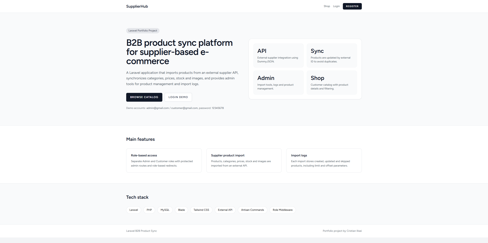
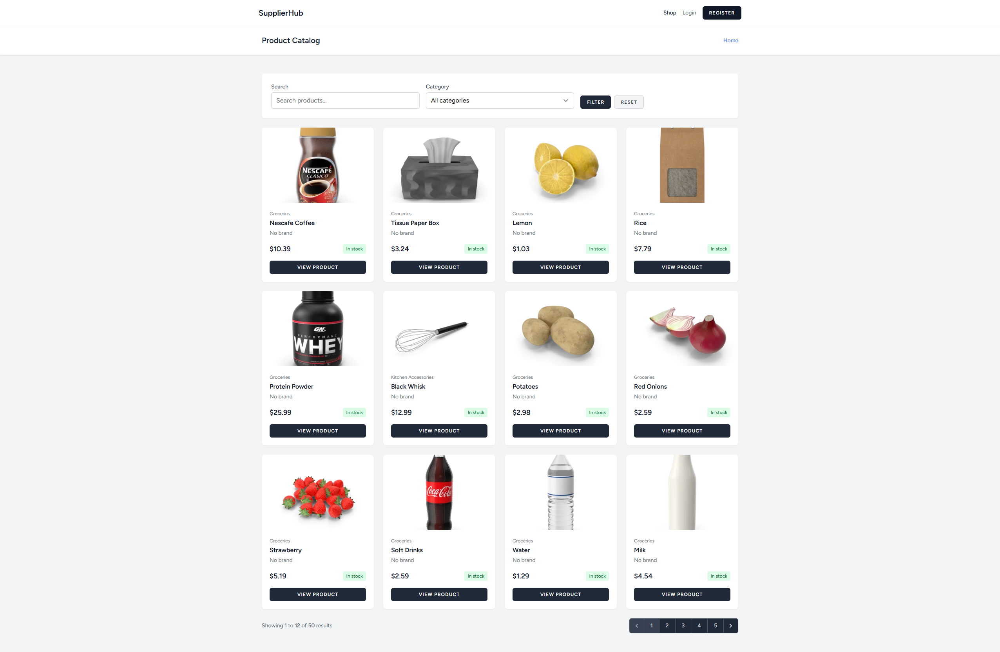
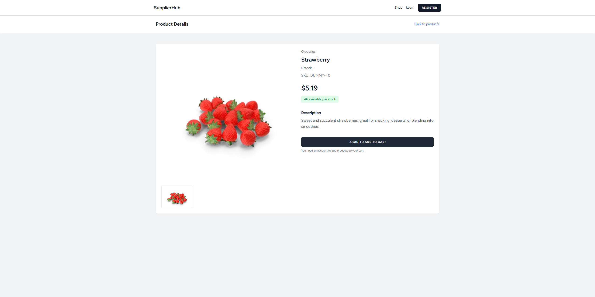
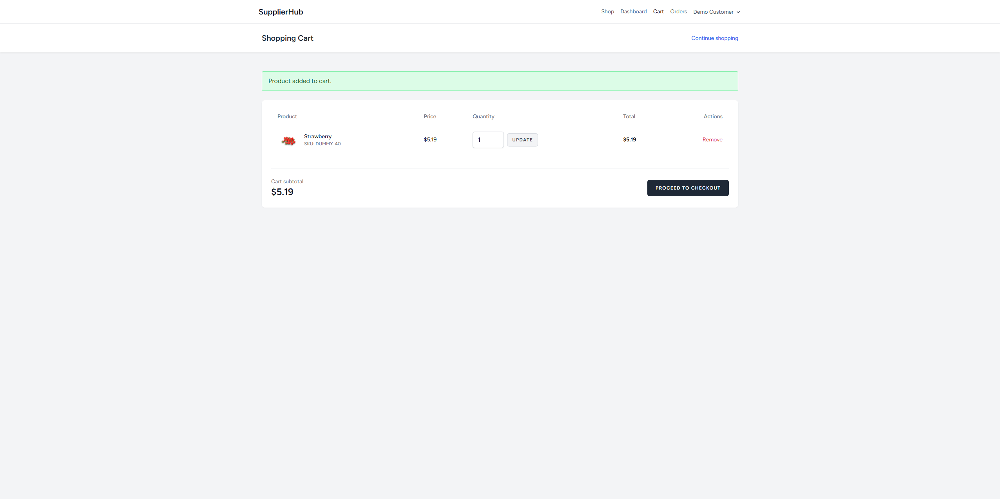
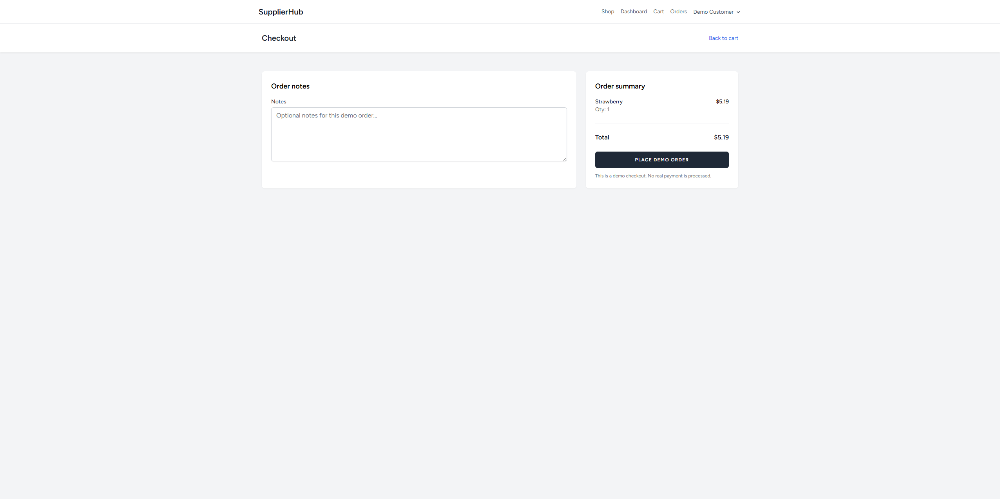
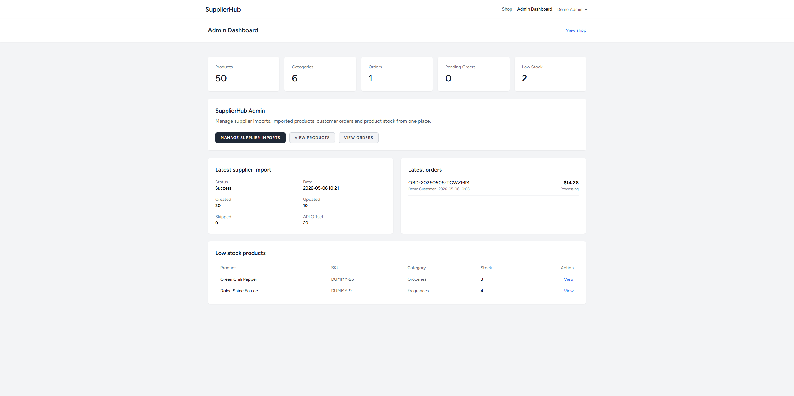
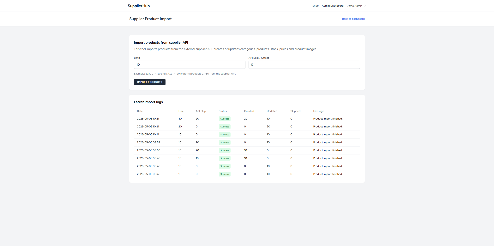
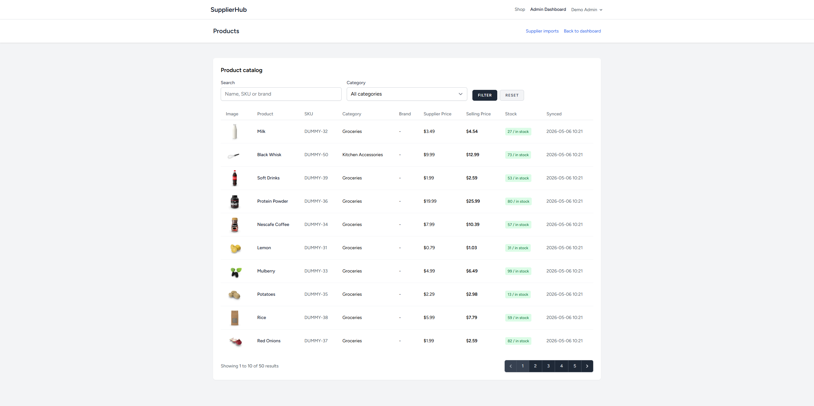
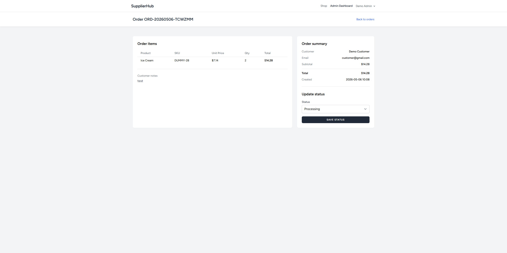

# Laravel B2B Product Sync

A Laravel portfolio project that simulates a supplier-based e-commerce platform.

The application imports products from an external supplier API, synchronizes categories, prices, stock and images, and provides both an admin area and a customer shopping flow.

## Demo Accounts

Admin account:

```text
Email: admin@gmail.com
Password: 12345678
```

Customer account:

```text
Email: customer@gmail.com
Password: 12345678
```

## Main Features

### Authentication and Roles

- User authentication using Laravel Breeze
- Admin and Customer roles
- Role-based redirects after login
- Protected admin routes using custom middleware
- Public product catalog available for guests

### Supplier API Integration

- External supplier API integration using DummyJSON
- Product import with pagination support
- Category creation and update
- Product creation and update using external supplier IDs
- Product image import
- Price calculation using a markup multiplier
- Stock synchronization
- Import logs with created, updated and skipped products
- Artisan command for supplier imports
- Scheduled automatic product synchronization using Laravel Scheduler

### Admin Area

- Admin dashboard with real statistics
- Product catalog management view
- Supplier import page
- Import history and logs
- Order management
- Order status update: pending, processing, completed, cancelled
- Low-stock product overview

### Customer Area

- Public product catalog
- Product details page
- Shopping cart
- Quantity update and remove from cart
- Demo checkout flow
- Customer order history
- Order details page

## Tech Stack

- Laravel
- PHP
- MySQL
- Blade
- Tailwind CSS
- Laravel Breeze
- External API integration
- Artisan Commands
- Laravel Scheduler
- Custom Middleware
- Eloquent Relationships
- Database Seeders

## Project Structure Highlights

```text
app/
├── Actions/
│   └── ImportSupplierProductsAction.php
├── Console/Commands/
│   └── ImportSupplierProductsCommand.php
├── Http/Controllers/
│   ├── Admin/
│   │   ├── DashboardController.php
│   │   ├── OrderController.php
│   │   ├── ProductController.php
│   │   └── SupplierImportController.php
│   └── Shop/
│       ├── CartController.php
│       ├── CheckoutController.php
│       ├── OrderController.php
│       └── ProductController.php
├── Http/Middleware/
│   └── AdminMiddleware.php
├── Models/
│   ├── CartItem.php
│   ├── Category.php
│   ├── ImportLog.php
│   ├── Order.php
│   ├── OrderItem.php
│   ├── Product.php
│   ├── ProductImage.php
│   ├── Role.php
│   └── User.php
└── Services/
    └── DummyJsonSupplierService.php
```

## Supplier Import Flow

The import system fetches products from the external supplier API and stores them locally.

On repeated imports, products are not duplicated. They are updated using the external supplier product ID.

```text
Supplier API
    ↓
DummyJsonSupplierService
    ↓
ImportSupplierProductsAction
    ↓
Categories / Products / Product Images
    ↓
Import Logs
```

The import can be triggered from:

- Admin interface
- Artisan command

```bash
php artisan supplier:import-products --limit=10 --skip=0
```

## E-commerce Flow

```text
Customer browses catalog
    ↓
Customer opens product details
    ↓
Customer adds product to cart
    ↓
Customer updates quantity or removes products
    ↓
Customer places demo order
    ↓
Stock is reduced locally
    ↓
Admin views and updates order status
```

## Database Entities

Main tables used by the application:

- users
- roles
- categories
- products
- product_images
- import_logs
- cart_items
- orders
- order_items

## Installation

Clone the repository:

```bash
git clone https://github.com/cristianilisei96/laravel-b2b-product-sync.git
cd laravel-b2b-product-sync
```

Install PHP dependencies:

```bash
composer install
```

Install frontend dependencies:

```bash
npm install
```

Copy the environment file:

```bash
cp .env.example .env
```

Generate the application key:

```bash
php artisan key:generate
```

Configure your database in `.env`:

```env
DB_CONNECTION=mysql
DB_HOST=127.0.0.1
DB_PORT=3306
DB_DATABASE=laravel_b2b_product_sync
DB_USERNAME=root
DB_PASSWORD=
```

Run migrations and seeders:

```bash
php artisan migrate:fresh --seed
```

Start the Laravel development server:

```bash
php artisan serve
```

Start Vite:

```bash
npm run dev
```

Open the application:

```text
http://127.0.0.1:8000
```

## Useful Commands

Import products from the supplier API:

```bash
php artisan supplier:import-products --limit=10 --skip=0
```

Reset database and seed demo data:

```bash
php artisan migrate:fresh --seed
```

Clear Laravel cache:

```bash
php artisan optimize:clear
```

## Screenshots

### Landing Page



### Product Catalog



### Product Details



### Shopping Cart



### Checkout



### Admin Dashboard



### Supplier Import



### Admin Products



### Admin Order Details



## Future Improvements

- Multi-page scheduled supplier synchronization
- Queue-based imports
- Product editing in admin
- More advanced stock rules
- Product search improvements
- Order email notifications
- Payment provider integration in test mode
- REST API endpoints for products and orders
- Automated tests
- Docker setup for easier local installation

## What This Project Demonstrates

This project demonstrates practical Laravel skills, including:

- Building a role-based application
- Working with external APIs
- Mapping external supplier data into a local database
- Preventing duplicate products during repeated imports
- Managing product stock and prices
- Building admin dashboards
- Creating a basic e-commerce flow
- Using Eloquent relationships
- Using custom middleware
- Creating Artisan commands
- Structuring code into services and actions

## Author

Cristian Ilisei

- GitHub: https://github.com/cristianilisei96
- LinkedIn: https://www.linkedin.com/in/cristianilisei96
